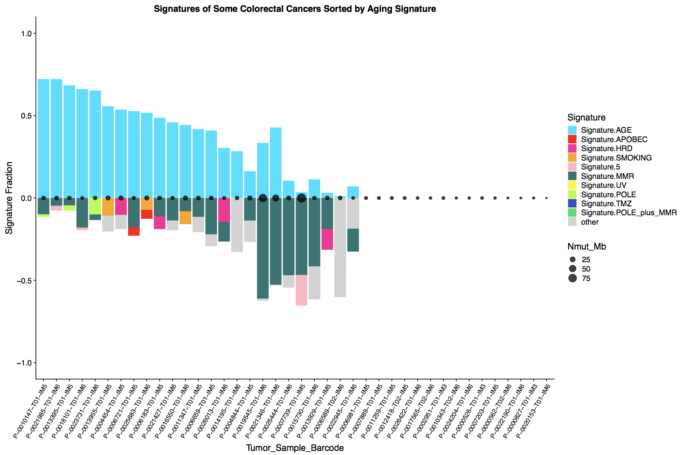

# mutationSignatureWaterfallPlots 
utilities to make waterfall plots of mutation signature data

**Usage**: 
Get ids of cases you want to look at signatures of. Run python script, then interactively run R script to your heart's content 
More specificially: 
run python format_plotting_info.py 
The options are: 
--signature_data_file: a file with signature information.  It needs to have columns of the form either mean_1, mean_2 etc or Signature.1, Signature.2 etc 
--writeFileName: filename for formated information for plotting 
--writeFileDir: directory to write the file in 
--idsFile: ids for the cases whose signatures you want to plot.  Ids can be in csv, tsv or new line separated format 
--primarySortSig: the signature whose value goes up in the waterfall and everything is first sorted on 
--minMutThreshold: the minimum number of mutations below which we ignore signatures info 
--signatureOrdering: a file of signature names in the order you want dominant signatures to appear left to right on the plot. Refer to the files in this repo signatureOrdering.txt and signatureOrdering2_POLE_.txt for examples.  Note: the following signatures need to be referred to by their human readable name in this file: Signature.1 (Signature.AGE), Signature.2/Signature.13 (Signature.APOBEC), Signature.3 (Signature.HRD), Signature.4 (Signature.SMOKING), Signature.6/15/20/21 (Signature.MMR), Signature.7 (Signature.UV), Signature.10 (Signature.POLE), Signature.11 (Signature.TMZ) and Signature.14(Signature.POLE_plus_MMR) 

This will generate a tsv file (writing file to /your/path/here.tsv)
Open plot_signature_waterfall_plot.R, run the function plot_signature_waterfall() to generate a plot
The options for this function are:
df (dataframe)  
title  
plottingLevels_ (ordering of signature colors by signature name) 
barColorPalette_ (ordered colors for signature bars)  
includeThirdSignature (set to true to plot two signatures on lower bar)   
includeNMut_Mb_Info (set to false to leave out the dots representing mutation burden)  
                                

**Examples and Interpretation**

Here is an example of a plot generated by running python format_plotting_info.py (all defaults) and using first bar colors in R 

python format_plotting_info.py --idsFile test_signature_case_ids2_POLE_.txt --primarySortSig Signature.POLE --signatureOrdering signatureOrdering2_POLE_.txt

