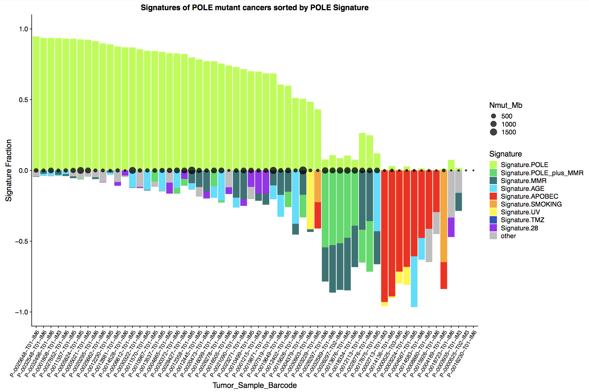

# mutationSignatureWaterfallPlots
utilities to make waterfall plots of mutation signature data

Usage: Get ids of cases you want to look at signatures of. Run python script, then interactively run R script to your heart's content 
More specificially: 
run python format_plotting_info.py 
The options are: 
--signature_data_file: a file with signature information.  It needs to have columns of the form either mean_1, mean_2 etc or Signature.1, Signature.2 etc 
--writeFileName: filename for formated information for plotting 
--writeFileDir: directory to write the file in 
--idsFile: ids for the cases whose signatures you want to plot.  Ids can be in csv, tsv or new line separated format
--primarySortSig: the signature whose value goes up in the waterfall and everything is first sorted on
--minMutThreshold: the minimum number of mutations below which we ignore signatures info
--signatureOrdering: a file of signature names in the order you want dominant signatures to appear left to right on the plot.

python format_plotting_info.py --idsFile test_signature_case_ids2_POLE_.txt --primarySortSig Signature.POLE --signatureOrdering signatureOrdering2_POLE_.txt

